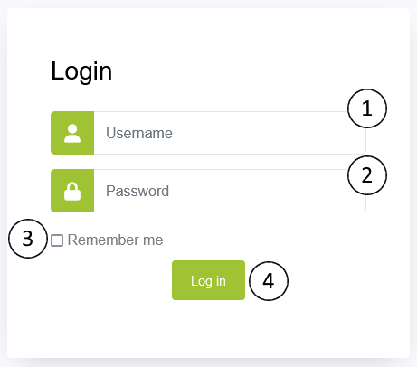

# Sistem Informasi Akademik
Software ini berguna untuk membantu interaksi online antar guru dan siswa. Dokumentasi ini akan membantu anda untuk menggunakan software yang telah disediakan.

## Login
Untuk menggunakan situs, pengguna harus memiliki akun dalam sistem. Jika anda adalah pengguna, *username* dan *password* bisa didapatkan dari staff administrasi akademik.

1. **Username**: Identifikasi akun anda.
2. **Password**: Kata sandi untuk masuk ke akun anda.
3. **Remember Me**: Berguna untuk memastikan bahwa anda tetap login.
4. **Log in**: Masuk ke dalam akun.

Ada empat tipe akun dalam sistem; [Administrator](account_types/admin/main.md), [Teacher](account_types/teacher/main.md), [Student](account_types/student/main.md) dan [Parent](account_types/parent/main.md). Setiap tipe akun memiliki peran masing-masing dalam sistem.

## Halaman Utama
Halaman ini akan muncul setelah masuk ke dalam akun. Berikut adalah halaman utama tipe akun `Student`.

### Quick Select

Setiap tipe akun memiliki tampilan yang sama, tapi akun memiliki fungsi yang berbeda. Dalam halaman utama, terdapat beberapa cara navigasi dalam situs untuk penggunaan sistem. Ketika masuk ke dalam sistem, anda bisa melakukan navigasi langsung dari halaman utama.

Link nama akun akan menuju ke dalam halaman profil, dan tombol yang ditampilkan akan menuju sesuai dengan yang tertulis. Dalam hal ini, akun adalah tipe `Student`, dan dipegang oleh seorang pelajar dalam institusi akademik bernama **Budi Rudianto Ikhsan**. Mereka hanya bisa melihat **Mata Pelajaran**.

### Sidebar

Selain melalui halaman utama, pengguna juga bisa navigasi dari *sidebar*. Bagian ini akan terus ada dalam halaman sistem lain-nya. Bagian `Informasi` menuju ke situs dokumentasi. Halaman yang bisa diakses bergantung dengan tipe akun pengguna.

### Header

Sama seperti *sidebar*, bagian *header* akan terus ada dalam halaman sistem lain-nya. Bagian ini berguna untuk navigasi ke [Pengaturan](general/settings.md), [Profil](general/profile.md) atau **Keluar Akun**.

> [!WARNING]
> Pengguna direkomendasikan keluar dari akun secara manual setelah menggunakan komputer publik, seperti waroeng internet. Hal ini dilakukan untuk memastikan keamanan akun anda.

## Paduan
Tergantung dengan tipe akun pengguna, setiap bagian sistem memiliki paduan tersendiri. Dokumentasi dan paduan sistem dapat dilihat dan diakses pada situs ini.