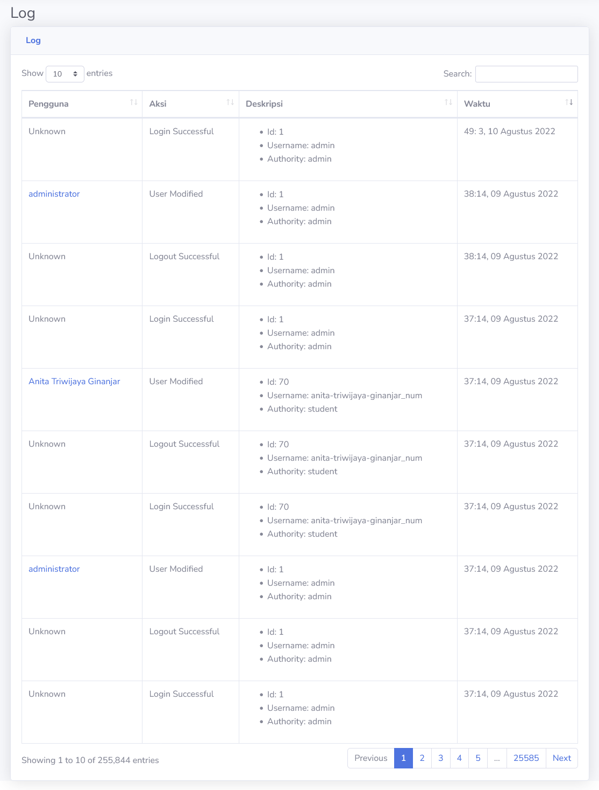

# Log
Bagian ini berfungsi untuk merekam aktivitas yang dilakukan oleh akun yang ada. Dari akun login dan logout, sampai pengumpulan tugas, semua informasi terekam disini.

> [!INFO]
> Bagian pengguna memberikan informasi tentang akun yang melakukan aksi tersebut. Aksi login dan logout tertera sebagai **Unknown**, karena informasi pengguna masuk atau keluar dari akun terekam pada deskripsi.

