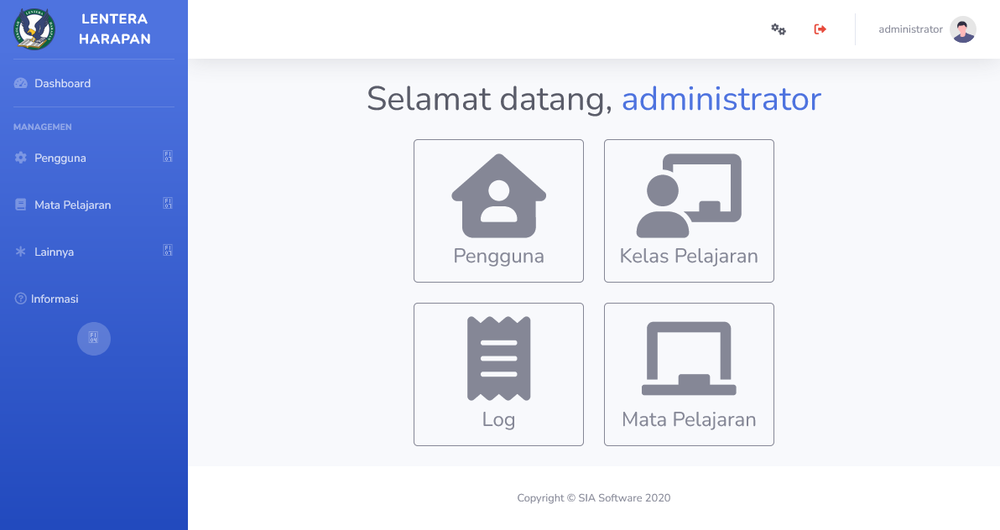
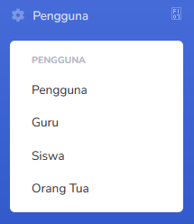
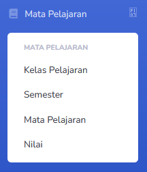
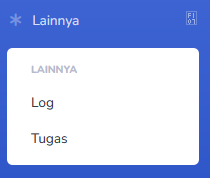

# Administrator
Akun **Admin** dipegang oleh administrasi dalam institusi pendidikan. Dengan akun ini, pengguna dapat membuat akun, memasukkan siswa ke kelas, membuat semester, dan lain-lain.

## Pengguna
Bagian **Pengguna** memiliki beberapa kategori. Bagian ini adalah tempat dimana **Admin** dapat membuat, mengubah atau menghapus akun dalam sistem.

> [!INFO]
> Hanya **Admin** dapat mengelola pengguna.

* [Pengguna](pengguna/pengguna.md): Melihat semua akun yang ada dalam sistem.
* [Guru](pengguna/guru.md): Melihat daftar guru yang aktif.
* [Siswa](pengguna/siswa.md): Melihat siswa yang aktif. Admin juga dapat mengelola siswa disini.
* [Orang Tua](pengguna/orang_tua.md): Melihat daftar orang tua yang aktif.

## Mata Pelajaran
Bagian **Mata Pelajaran** hampir sama dengan Guru, dengan beberapa perbedaan. **Admin** dapat membuat dan mengelola **Semester**, **Mata Pelajaran** dan **Bidang Mata Pelajaran** dalam sistem. Tipe akun ini juga dapat melakukan semua hal yang **Guru** dapat lakukan.

* [Kelas Pelajaran](account_types/teacher/kelas_pelajaran.md): Melihat dan mengelola semua kelas pelajaran yang disediakan. Berbeda dengan **Guru**, seorang Admin dapat melihat semua kelas yang ada.
* [Semester](account_types/admin/semester.md): Melihat dan mengelola semester akademik dalam sistem.
* [Mata Pelajaran](account_types/teacher/mata_pelajaran.md): Melihat dan mengelola semester akademik dalam sistem.
* [Nilai](account_types/teacher/nilai.md): Melihat nilai siswa secara keseluruhan.

## Lainnya
Bagian ini digunakan untuk mengelola sistem. Hanya **Admin** dapat melihat dan menggunakan bagian ini.

* [Log](account_types/admin/log.md): Informasi aktivitas yang terjadi dalam sistem.
* [Tugas](account_types/admin/tugas.md): Daftar tugas dari berbagai aktivitas yang ada. **Bagian ini digunakan untuk membersihkan file dalam sistem.**
