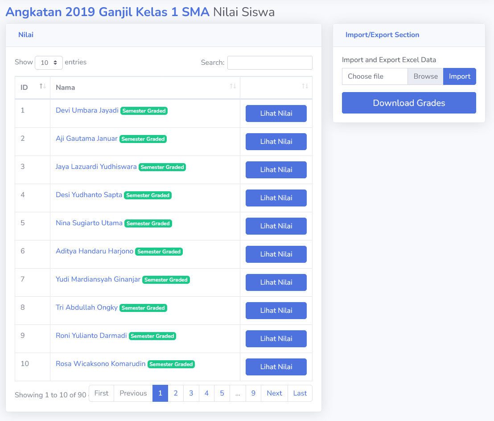
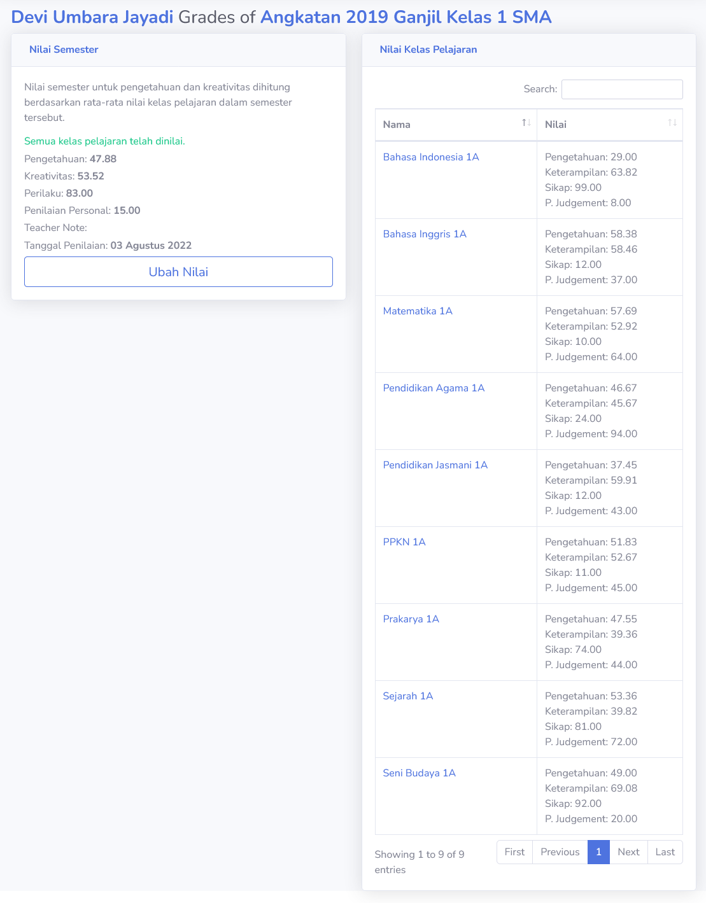
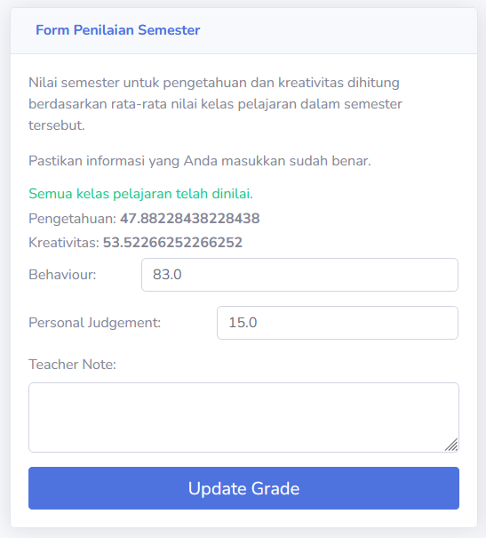

# Nilai Semester
Penilaian semester dapat dilakukan oleh **Guru** atau **Admin**. Pada bagian ini, nilai yang siswa dapat dalam kelas pelajaran akan dijadikan satu. Hasil nilai tersebut akan tampil pada nilai semester.

> [!TIP]
> Guru direkomendasikan untuk berdiskusi tentang penerapan nilai semester siswa terlebih dahulu, sebelum memasukkan data ke dalam sistem.

Tapi tidak semua nilai digunakan. Nilai **pengetahuan** dan **kreativitas** didapat dari kumpulan kelas pelajaran, sementara **perilaku** dan **penilaian personal (Personal Judgement)** harus dimasukkan secara manual.

Bagian ini akan muncul ketika melihat semester yang sudah selesai. Ini juga dapat menjadi indikator jika ada siswa yang belum memiliki nilai semester.

## Semester Nilai Siswa
**Admin** dan **Guru** dapat melihat dan mengelola nilai semester siswa disini. Berikut adalah contoh halaman nilai semester siswa, dimana semua siswa sudah dinilai dengan benar.

Halaman ini akan memberitahu siswa mana yang belum memiliki nilai.

> [!INFO]
> Sama seperti bagian penilaian lain, fitur Import dan Export Excel juga tersedia. Informasi lebih lanjut bisa dilihat [disini](../../general/import_export.md).

### Lihat Nilai
Halaman penilaian dan melihat nilai semester siswa bersifat identik. Pada sebelah kanan, seluruh nilai kelas pelajaran siswa akan ditampilkan sebagai referensi. Bagian pengetahuan dan kreativitas semester didapat dari kelas pelajaran.

Bagian ini juga memiliki indikator jika ada nilai kelas pelajaran yang belum dinilai. Pengguna dapat mengetahui nilai yang kosong dan memberitahu guru yang mengajar kelas tersebut.

> [!TIP]
> Meski **Admin** dapat memberikan nilai kelas pelajaran pada siswa secara langsung, pengguna direkomendasikan berkoordinasi dengan guru pemilik kelas. Hal ini dilakukan untuk mengurangi masalah komunikasi dalam penilaian.

### Ubah atau Nilai Siswa
Pengguna dapat mengubah nilai perilaku (Behaviour) dan penilaian personal (Personal Judgement) pada halaman yang sama. Tampilan pemberian nilai baru identik dengan tampilan ubah nilai.

Bagian **Teacher Note** berguna sebagai nota guru atau penilai untuk siswa dalam semester.

