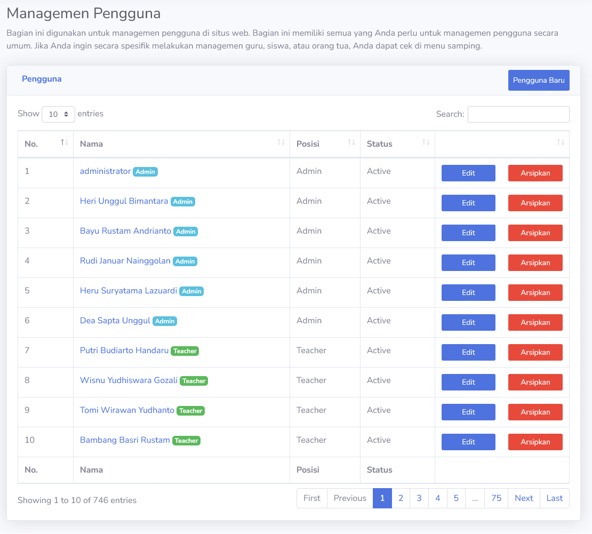
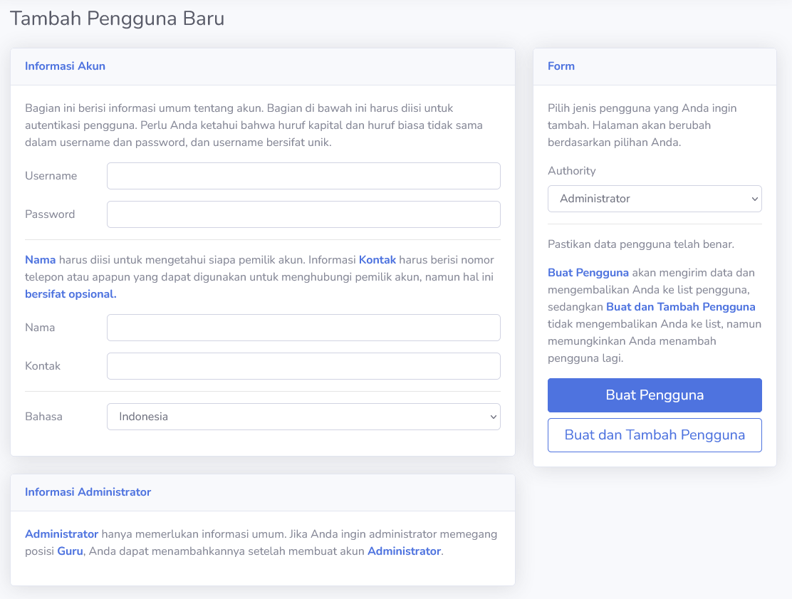
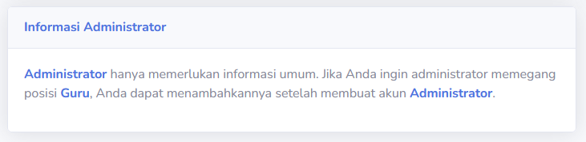
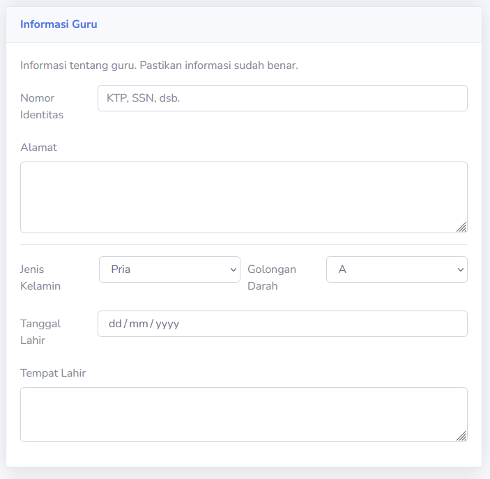
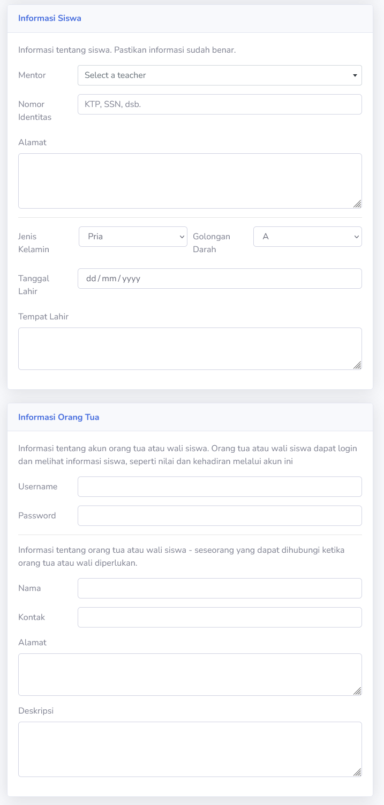

# Kelola Pengguna
Bagian ini berguna untuk menampilkan dan mengelola akun pengguna sistem. Hanya **Admin** yang dapat membuat dan mengelola akun pengguna lain. Hal ini juga termasuk mengnonaktifkan akun pengguna.

Bagian **Edit** akan masuk ke bagian edit profil akun. Disini, **Admin** dapat mengubah informasi akun lain, termasuk password.

Bagian **Arsipkan** berguna untuk menutup akun dengan menonaktifkannya.

Jika pengguna ingin menambah akun baru, bisa menekan tombol **Pengguna Baru**.

## Pengguna Baru
Admin hanya dapat membuat tiga tipe akun; **Administrator**, **Guru (Teacher)** dan **Siswa (Student)**. Semua akun membutuhkan **Username**, **Password**, **Nama** dan **Kontak**. Pastikan anda menggunakan tipe Authority yang benar.

Bagian **Bahasa** adalah bahasa yang akan digunakan pengguna akun. Ada dua bahasa yang tersedia; English dan Indonesia. Bahasa Indonesia akan terpilih sebagai awal bahasa. Ini dapat diubah oleh **Admin** atau pemilik akun sendiri.

Setelah semua informasi di isi, anda dapat membuat akun dengan **Buat Pengguna** atau **Buat dan Tambah Pengguna**. Mereka memiliki fungsi yang sama, tapi **Buat dan Tambah Pengguna** tidak akan memindahkan halaman setelah membuat akun. Melainkan, pengguna akan mendapat halaman baru untuk membuat akun. Hal ini akan mempercepat pembuatan akun sistem.

> [!WARNING]
> Otoritas akun yang sudah dibuat tidak dapat diubah. Jika ada ketidaksengajaan, hapus dan buat ulang akun tersebut.

### Informasi Administrator
Setiap tipe akun yang dipilih dalam Form itu berbeda. Untuk Admin, mereka hanya membutuhkan informasi akun.

> [!INFO]
> Halaman memberi sugestis untuk membuat akun tersendiri dengan **Admin**. Tetapi, tidak ada salahnya jika akun **Admin** dipegang oleh guru yang mengelola sistem.

### Informasi Guru
Bagian ini berisi informasi tambahan yang guru harus miliki.

> [!INFO]
> Hanya akun **Guru (Teacher)** yang dapat menjadi guru wali (mentor) siswa.

### Informasi Siswa dan Wali (Orang Tua)
Ketika membuat akun siswa, anda juga membuat akun wali-nya. Selain informasi tambahan yang harus dimiliki, siswa juga harus memiliki guru wali (mentor). Setelah akun dibuat, **Admin** dapat memberikan semester dan kelas kepada siswa.

Informasi Orang Tua akan membuat akun orang tua. Pastikan Username dan Password terisi dengan benar.

> [!INFO]
> Bahasa yang diterapkan pada Orang Tua adalah **Indonesia**.

> [!TIP]
> Pada pemasukan siswa baru, anda direkomendasikan untuk membuat semua akun siswa baru terlebih dahulu, sebelum memberikan semester kepada akun siswa. Tampilan siswa yang belum memiliki semester adalah sebagai berikut:
> 

