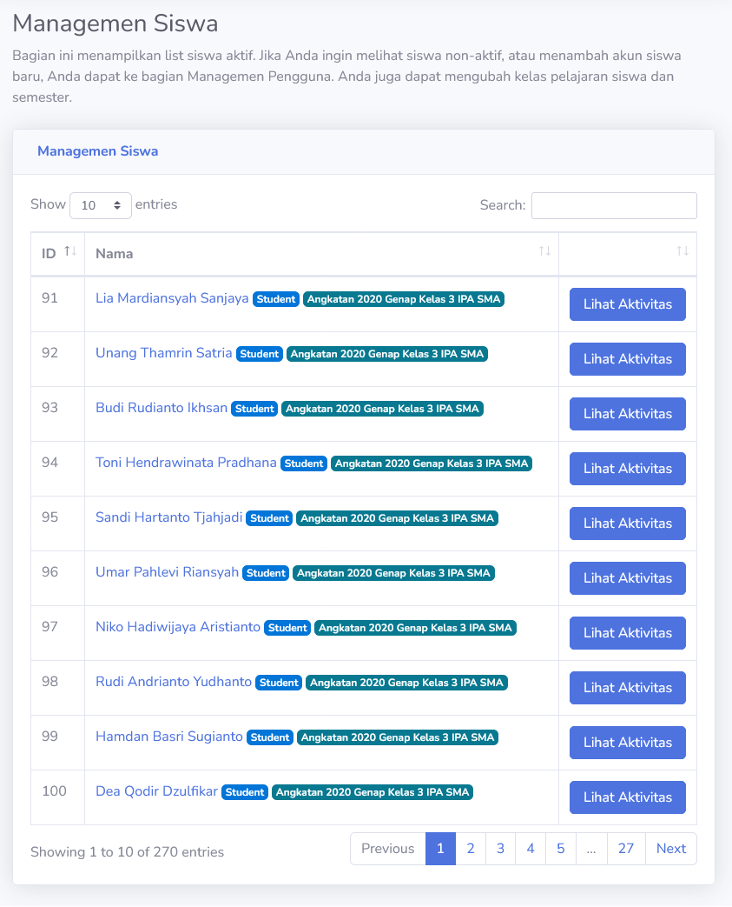
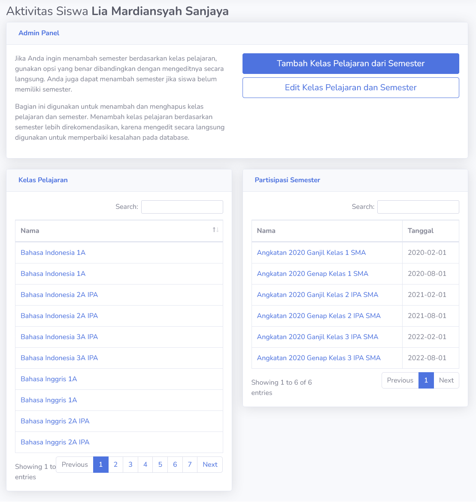
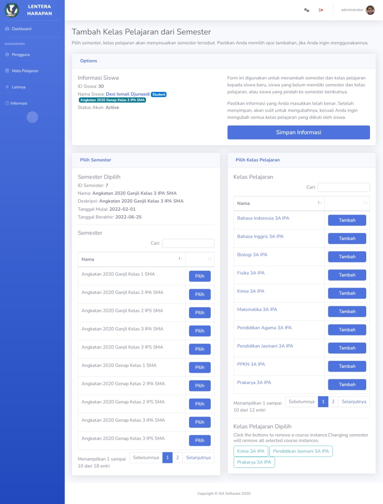
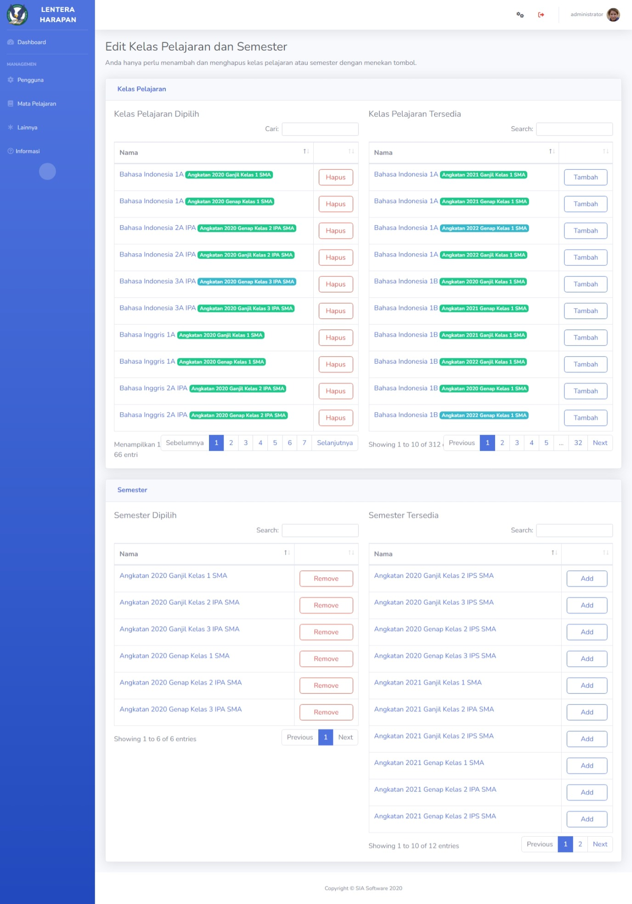

# Kelola Siswa
Halaman ini menampilkan daftar akun **Student** yang aktif dalam sistem. Disini, **Admin** juga dapat mengelola siswa dalam sistem, seperti memindah semester atau mengubah kelas pelajaran yang siswa jalankan.

## Lihat Aktivitas
Secara umum, siswa dapat memiliki lebih dari satu semester. Hal ini tampak ketika pengguna melihat nilai siswa secara keseluruhan. Pada halaman ini, **Admin** dapat mengelola semester dan kelas pelajaran yang siswa jalani.

> [!INFO]
> Semester yang ditampilkan pada nama siswa adalah semester yang memiliki tanggal mulai paling baru.

> [!WARNING]
> Kelas pelajaran yang siswa lihat tidak bergantung dengan semester. Melainkan, mereka bergantung dengan keaktifan kelas pelajaran. Jika kelas pelajaran aktif, maka siswa dapat mengakses-nya. **Keaktifan kelas pelajaran bergantung dengan tanggal semester.**

### Tambah Kelas Pelajaran Dari Semester
Halaman ini digunakan untuk menambah kelas pelajaran kedalam siswa. Secara umum, bagian ini digunakan untuk transisi satu semester ke semester lain, atau memasukkan siswa baru ke dalam semester.

Ada opsi tambahan yang berguna untuk mempermudah fungsi. **Tambah semester ke siswa** akan menambah semester yang dipilih ke dalam siswa. **Hapus kelas pelajaran siswa** akan menghapus semua kepemilikan pelajaran kelas yang siswa miliki sebelumnya.

> [!WARNING]
> Hanya centang opsi **Tambah semester ke siswa** jika ingin transisi semester siswa. Opsi **Hapus kelas pelajaran siswa** akan menginvalidasi partisipasi siswa dalam kelas pelajaran tersebut.

Untuk menggunakan, pengguna pertama harus memilih semester yang ingin digunakan. Kemudian, pilih kelas pelajaran yang ingin ditambah. Untuk menghapus kelas pelajaran yang dipilih, bisa di klik pada tombol dibawah.

> [!INFO]
> Menambah kelas pelajaran akan menambah semester secara otomatis.

Setelah perubahan dilakukan, pengguna dapat menerapkan perubahan dengan **Simpan Informasi**.

### Edit Kelas Pelajaran dan Semester
Bagian ini berguna untuk memodifikasi kelas pelajaran dan semester yang siswa miliki secara manual.

Terkadang **Tambah Kelas Pelajaran Dari Semester** tidak memberikan fitur yang lengkap untuk mengubah kelas pelajaran dan semester siswa. Ini sengaja, karena fitur itu berguna untuk membantu transisi semester siswa, atau memasukkan siswa baru ke dalam semester dan kelas pelajaran.

Dalam halaman ini, Admin dapat mengeluarkan atau memasukkan siswa dari kelas pelajaran dan semester. Pengguna hanya perlu klik tombol yang ada, dan sistem akan melakukan perubahan secara langsung.

