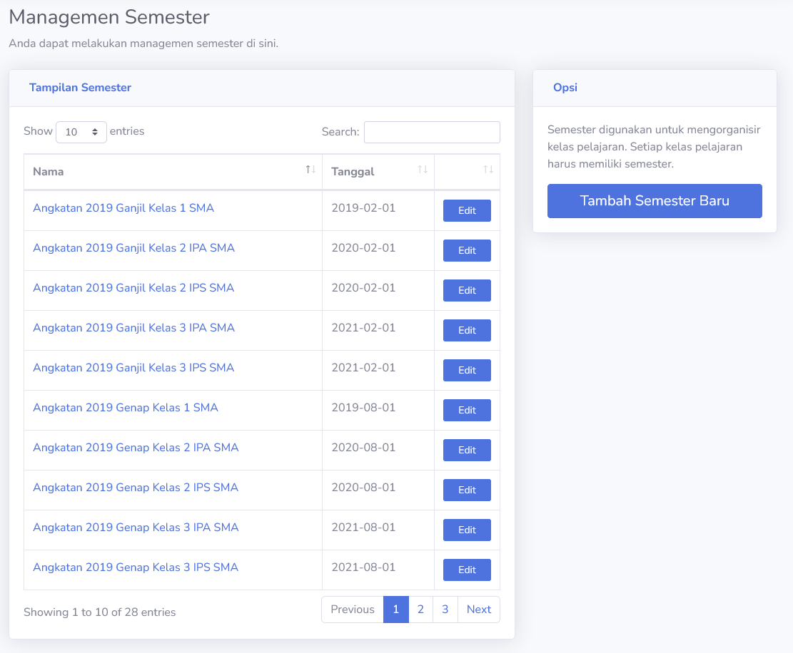
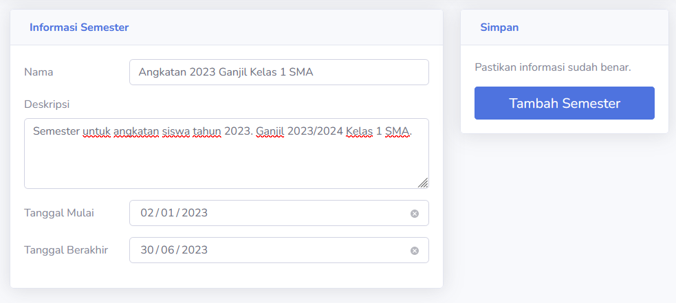
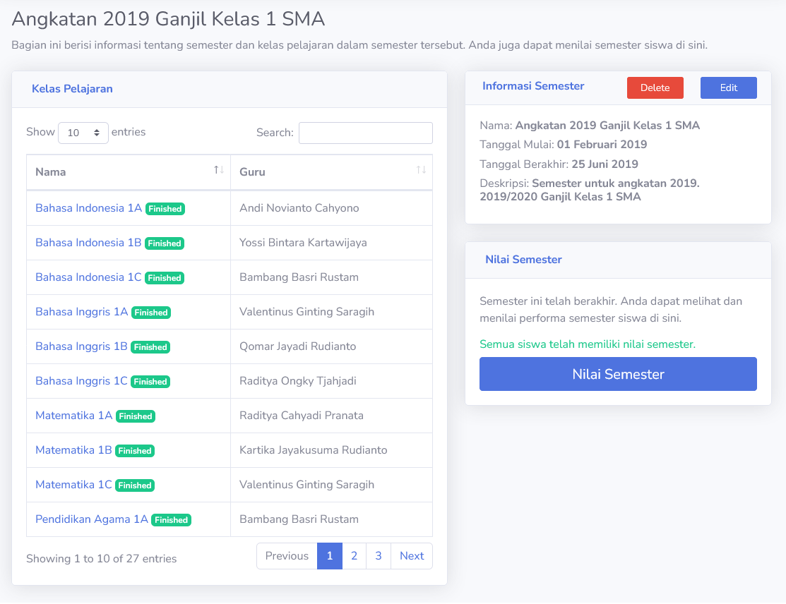

# Semester
Semester berguna untuk mengkategorisasikan kelas pelajaran menjadi satu perjalanan akademik. Dalam contoh sistem ini, semester digunakan untuk memisahkan angkatan, kelas dan bidang siswa.

Semester memiliki tanggal mulai dan tanggal akhir. Sebelum tanggal mulai, guru dapat membuat kelas pelajaran dalam semester, dan mempersiapkan kurikulum mereka.

Ketika semester mulai, siswa dapat melihat kelas yang disediakan. Mereka dapat mulai berinteraksi dengan guru.

Setelah semester berakhir, siswa tidak dapat melihat kelas tersebut, dan guru dapat memberikan nilai ke kelas atau semester. Hasil penilaian akan muncul pada daftar nilai keseluruhan.

Pada bagian ini, **Admin** dapat membuat dan mengelola semester dalam sistem.

## Tambah Semester Baru
Tampilan mengubah dan membuat semester baru sangatlah identik. Ada bagian nama, deskripsi, tanggal mulai dan akhir semester yang harus di-isi. Setelah semester dibuat, kelas pelajaran dapat langsung menggunakan semester tersebut.

> [!INFO]
> Semua kelas pelajaran dalam semester akan mengikuti tanggal dari semester.

## Informasi Semester
Dalam bagian ini, **Admin** dapat melihat informasi semester. Semua kelas pelajaran yang menggunakan semester akan ditampilkan disini, beserta informasi dan nilai semester.

> [!WARNING]
> Menghapus semester menggunakan **Delete** akan menghapus semua kelas pelajaran yang menggunakan-nya. Pastikan kelas pelajaran dipindah ke semester lain jika tidak ingin dihapus.

> [!INFO]
> Tampilan **Edit** semester identik dengan tampilan menambah semester. **Admin** dapat mengubah nama, deskripsi dan tanggal semester disini.

### Nilai Semester
Penilaian semester dapat dilihat [disini](account_types/admin/nilai_semester.md).