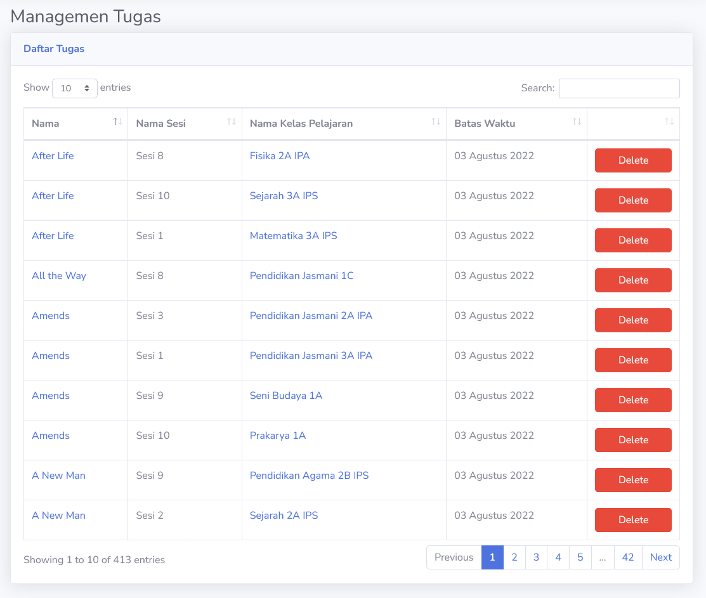

# Daftar Tugas
Halaman ini adalah tempat **Admin** untuk mengelola semua tugas dalam kelas pelajaran dalam sistem. Bagian ini ada untuk mempermudah Admin dalam menghapus tugas secara masal.

> [!TIP]
> Bagian ini berguna sebagai alat *debugging*, dimana jika ada masalah pada penyimpanan file tugas, **Admin** dapat langsung menemukan dan menghapus tugas yang bermasalah.

