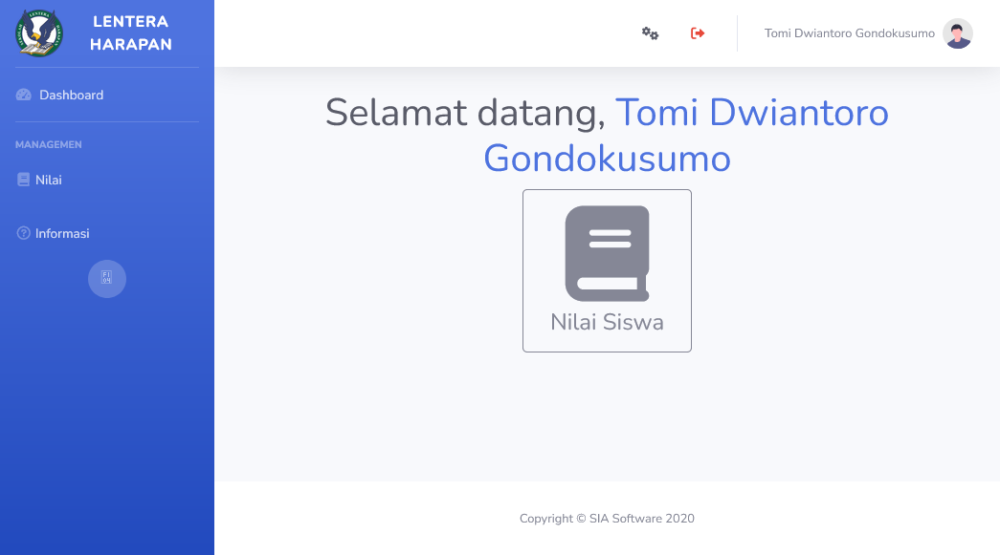
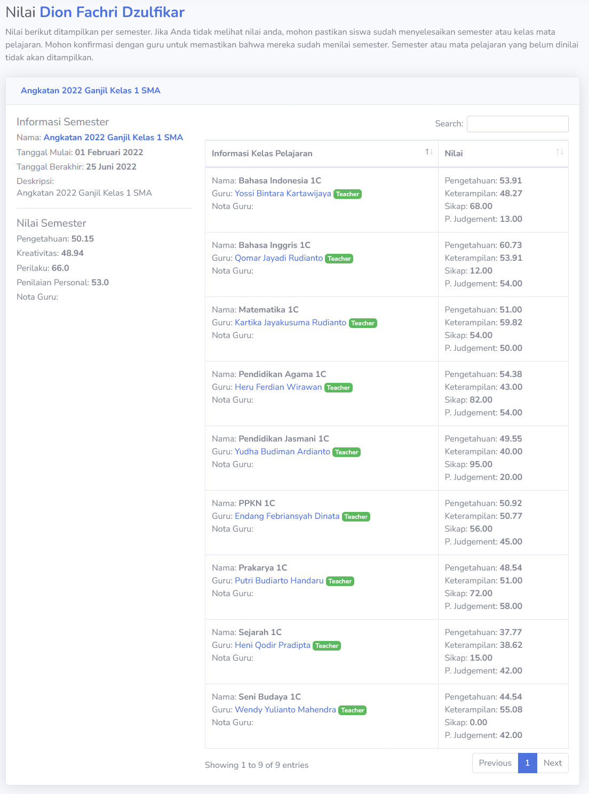

# Parent
Akun `parent` dipegang oleh orang tua siswa yang sedang menjalani perjalanan akademik dalam institusi pendidikan. Akun ini hanya memiliki satu fungsi; melihat nilai akademik siswa mereka.

> [!NOTE]
> Pemilik akun bisa mengganti dan mengubah informasi akun, seperti nama, alamat, username dan password mereka sendiri. Jika ada masalah dalam penggunaan, pemilik akun bisa menghubungi administrasi institusi akademik.

## Nilai Akademik
Ketika semester sudah selesai, orang-tua dapat melihat nilai siswa mereka. Harap diperhatikan bahwa siswa juga dapat melihat melihat mereka sendiri. Nilai hanya akan muncul ketika semester sudah berakhir dan dinilai oleh guru.

> ![TIP]
> Guru juga manusia. Jika merasa terdapat kesalahan pada penilaian, bisa menghubungi administrasi institusi akademik.

