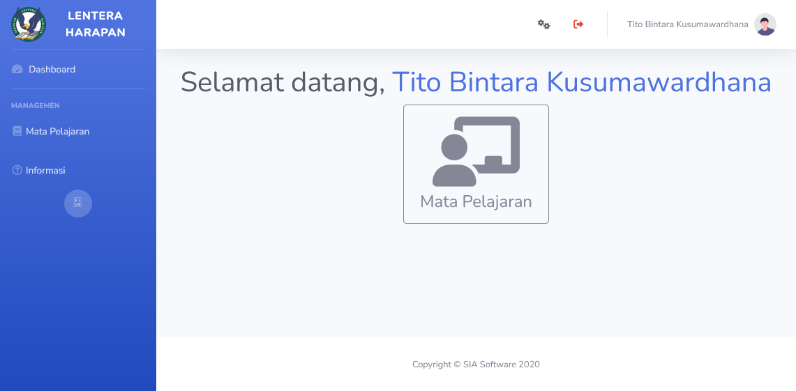
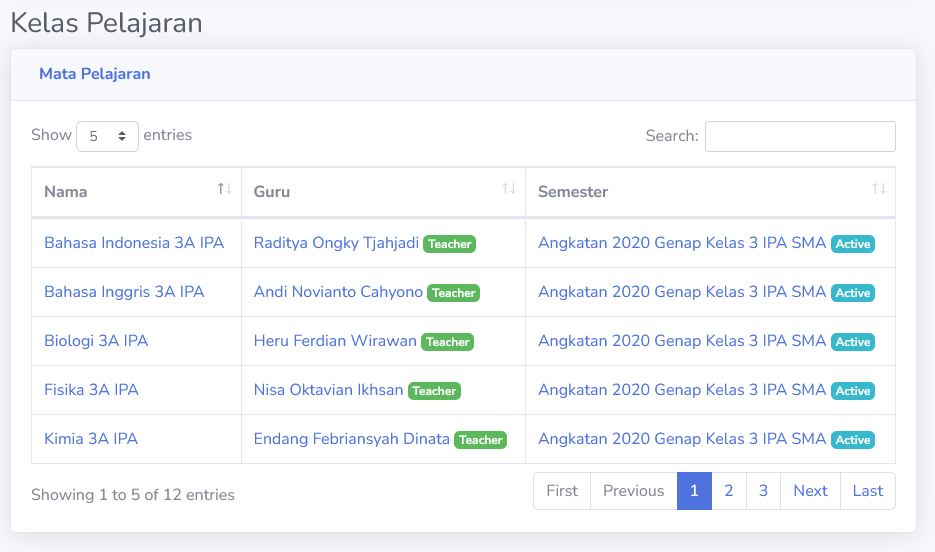
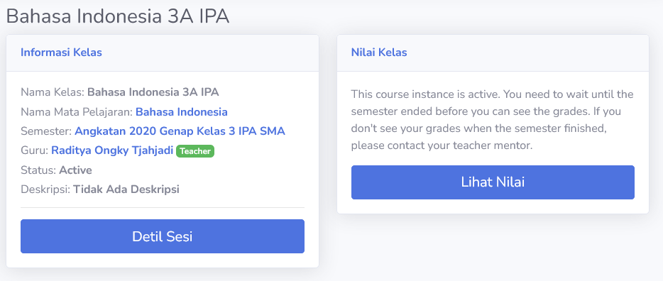
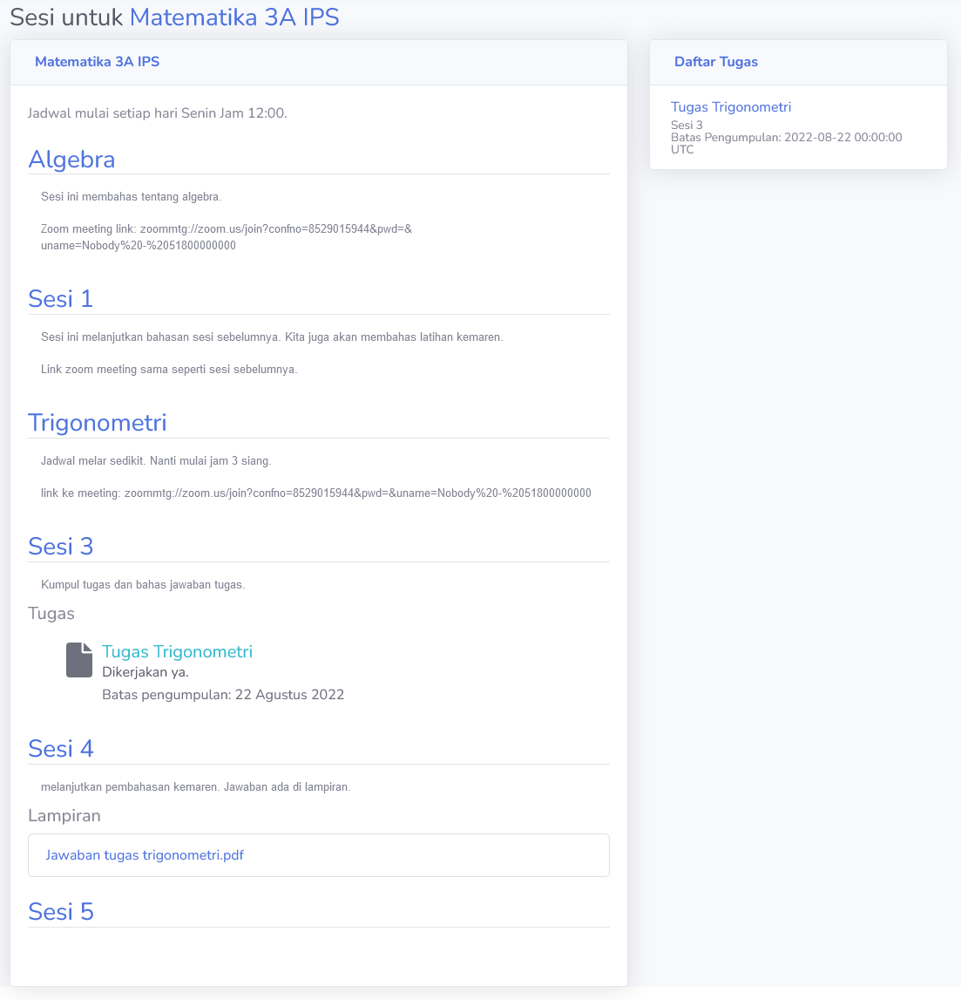
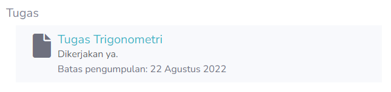

# Student
Akun `student` adalah akun yang dipegang oleh siswa atau pelajar dalam institusi pendidikan. Disini, siswa dapat berinteraksi dengan guru dari sistem.

## Kelas Mata Pelajaran
Disini, siswa dapat melihat kelas mata pelajaran yang aktif atau yang akan segera aktif. Siswa hanya dapat berinteraksi dengan mata pelajaran ketika semester sudah mulai.

> [!NOTE]
> Admin bertanggungjawab terhadap penempatan siswa dalam kelas mata pelajaran. Jika terdapat masalah, mohon hubungi administrasi institusi akademik.

### Kelas Overview
Ketika masuk ke dalam kelas, siswa dapat melihat informasi dasar kelas tersebut. Tombol **Lihat Nilai** akan menuju ke nilai siswa keseluruhan. Siswa dan orang-tua dapat mengakses tombol tersebut.

Tombol **Detil Sesi** akan masuk ke bagian sesi kelas. Halaman itu adalah halaman interaksi siswa dengan guru. Sebagian besar interaksi dilakukan disini.

### Sesi Kelas
Disini adalah tempat dimana siswa dapat berinteraksi dengan guru. Tugas dapat di upload disini, dan guru juga bisa memberikan file yang dibutuhkan.

> [!TIP]
> Selain melihat langsung dari sesi, bagian daftar tugas menampilkan tugas apa saja yang ada pada sesi.

#### Lampiran
Siswa dapat men-download lampiran yang diberikan oleh guru pada sesi.

#### Tugas Sesi
Ketika ada tugas dalam sesi, siswa harus mengerjakan tugas yang diberikan. Ketika guru meminta tugas, dalam bagian sesi, akan muncul tombol untuk melihat dan memasukkan tugas yang dikerjakan.

> [!NOTE]
> Siswa masih bisa mengunggah tugas meski sudah melewati deadline. Guru dapat melihat kapan tugas diunggah. Harap diperhatikan apakah guru akan tetap menilai tugas terlambat, atau akan memberikan nilai nol pada tugas terlambat.

> [!TIP]
> Siswa dapat memberbaharui tugas yang diunggah. Harap diperhatikan bahwa pembaharuan tugas yang diunggah akan memperbaharui tanggal pengumpulan tugas. **Siswa direkomendasikan untuk tidak memperbaharui tugas setelah melewati deadline.**

Bagian **Informasi tambahan dokumen** adalah pesan siswa ke guru tentang dokumen yang diberikan. Bagian ini bisa dikosongkan jika tidak ada pesan apapun.
