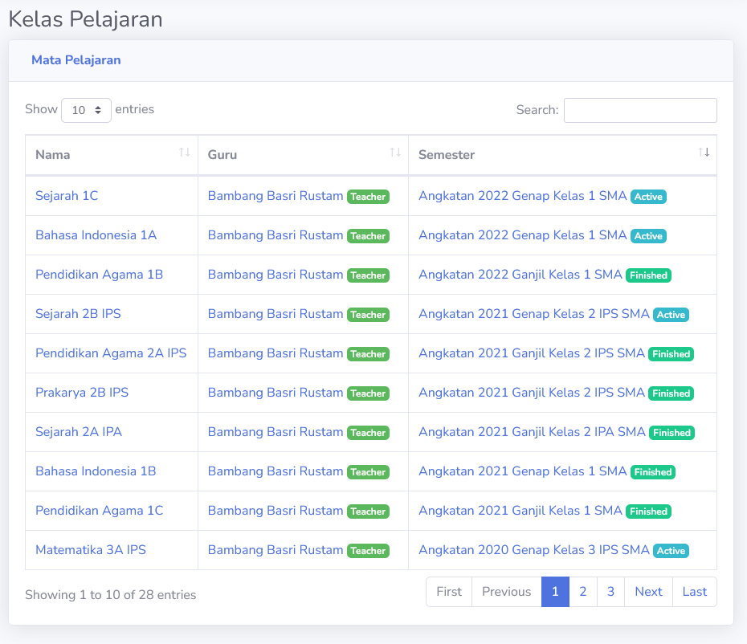
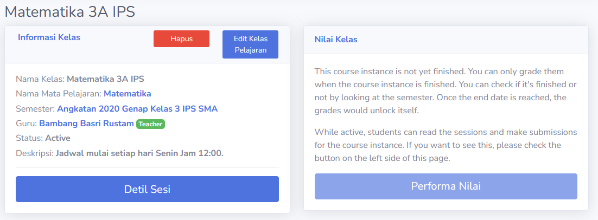
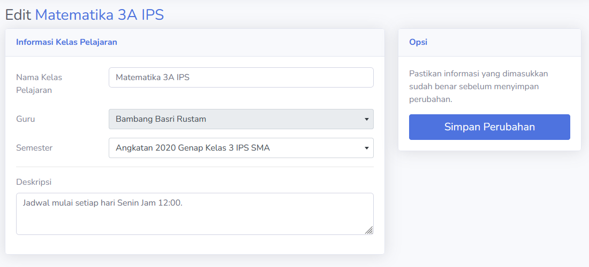
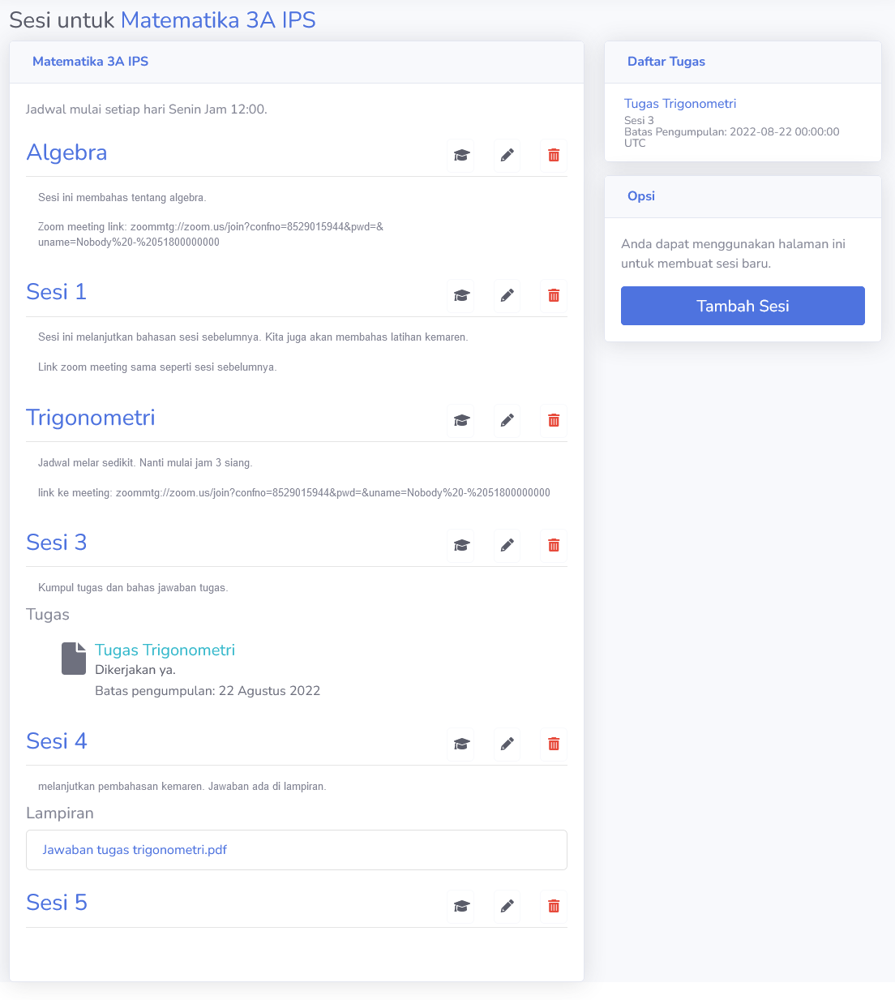
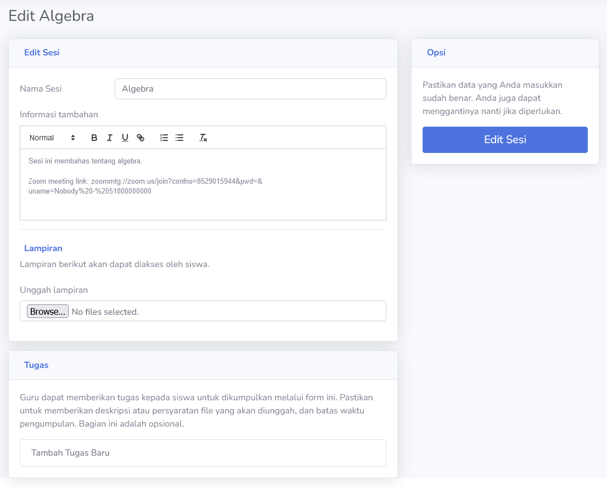
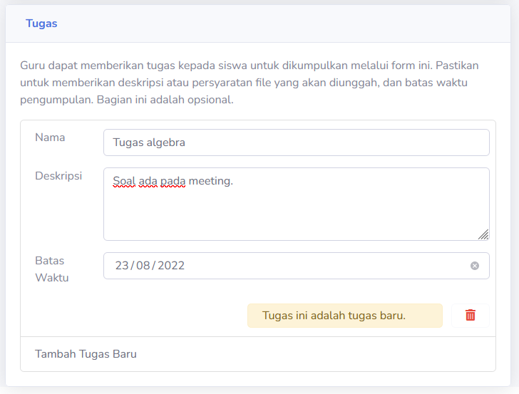
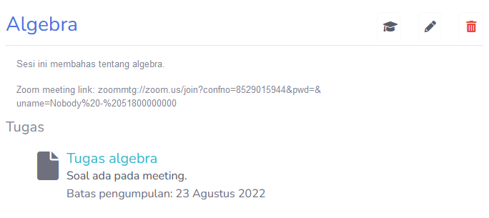

# Kelas Pelajaran
Pada halaman ini, guru dapat melihat kelas pelajaran yang mereka miliki. Sama seperti siswa, bagian ini adalah tempat guru berinteraksi dengan siswa. Dalam daftar kelas berikut, guru dapat melihat kelas mereka. Ini memungkinkan guru untuk mengajar lebih dari satu kelas.

Untuk masuk ke halaman kelas, bisa menggunakan link yang tersambung dengan nama kelas.

> [!INFO]
> Pengguna dapat melihat keaktifan semester dalam kelas pelajaran.

## Overview
Guru dapat melihat informasi kelas pelajaran disini. Halaman ini identik dengan halaman overview kelas milik pelajar. Hanya saja, tombol **Performa Nilai** hanya akan terbuka setelah semester sudah selesai. Guru juga dapat menghapus atau mengubah data kelas pelajaran mereka.

> [!INFO]
> Untuk informasi penilaian, bisa dilihat [disini](nilai.md).

### Mengubah Kelas Pelajaran
Dari halaman ini, pengguna dapat mengubah informasi kelas pelajaran. Sebagai guru, pengguna tidak dapat mengubah kepemilikan kelas. Hanya **Admin** dapat mengubah informasi tersebut. Setelah informasi diubah sesuai dengan keinginan, pengguna dapat menyimpan perubahan dengan **Simpan Perubahan**.

> [!WARNING]
> Jangan lakukan perubahan pada semester setelah siswa terdaftar dalam kelas.

## Kelas Sesi
Masuk kedalam **Detil Sesi**, guru dapat mengubah dan memanipulasi sesi yang ada. Dari membuat dan melihat tugas siswa, memberikan file yang dapat siswa download, sampai menilai siswa, guru dapat melakukan berbagai hal untuk membantu proses pembelajaran mereka.

Setiap sesi adalah satu sesi kelas. Guru dapat menghapus, membuat maupun menilai sesi tersebut.

### Manipulasi Sesi
Ada tiga tombol yang muncul di samping sesi; **Grade**, **Edit** dan **Delete**.

* **Grade**: Bagian untuk menilai sesi. Detil penilaian bisa dilihat [disini](nilai.md).
* **Edit**: Ubah informasi sesi.
* **Delete**: Hapus sesi.

#### Edit Sesi
Pada halaman ini, pengguna dapat melakukan berbagai perubahan pada satu sesi. Dari meng-upload file untuk siswa, sampai memberikan tugas, disini guru dapat mengubah data tersebut. Setelah melakukan perubahan yang di-inginkan, pengguna dapat menyimpan perubahan dengan tombol **Edit Sesi**.

> [!NOTE]
> Proses pembuatan sesi baru memiliki tampilan yang mirip.

##### Tugas
Sebuah sesi dapat memiliki lebih dari satu tugas. Berinteraksi dengan tombol **Tambah Tugas Baru** akan menambah tugas, dan menekan tombol sampah merah akan menghapus-nya.

> [!WARNING]
> Menghapus tugas berarti menghapus nilai dan pekerjaan siswa yang sudah disimpan dalam tugas itu.

Dan ketika tersimpan, akan muncul tugas yang siswa dapat upload.

Mengakses link tugas akan menuju ke bagian nilai. Untuk detil lebih lanjut tentang nilai, anda dapat mengakses informasi tersebut [disini](nilai.md).