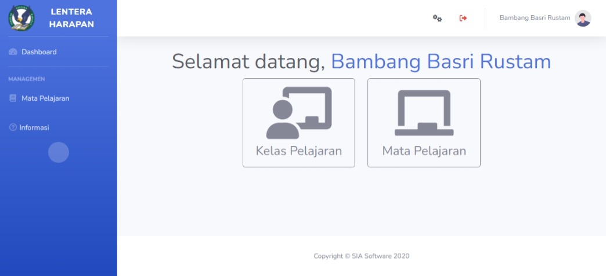
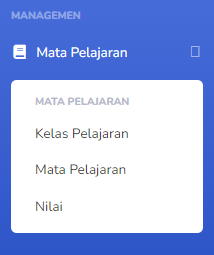

# Teacher
Akun `Teacher` adalah akun yang dipegang oleh guru dalam institusi pendidikan. Disini, guru dapat berinteraksi dengan siswa dalam naungan mereka.

## Fitur
Selain dari apa yang ada dalam halaman utama, pemegang akun `Teacher` memiliki beberapa fitur yang dapat mereka lakukan. Dari sidebar, guru dapat mengakses perihal yang mereka ingin urus.

Dari sini, guru dapat mengakses halaman lain;
* [Kelas Pelajaran](account_types/teacher/kelas_pelajaran.md): Akses kelas mata pelajaran dalam naungan guru.
* [Mata Pelajaran](account_types/teacher/mata_pelajaran.md): Melihat mata pelajaran yang disediakan oleh institusi pendidikan.
* [Nilai](account_types/teacher/nilai.md): Melihat dan mengurus nilai siswa.
