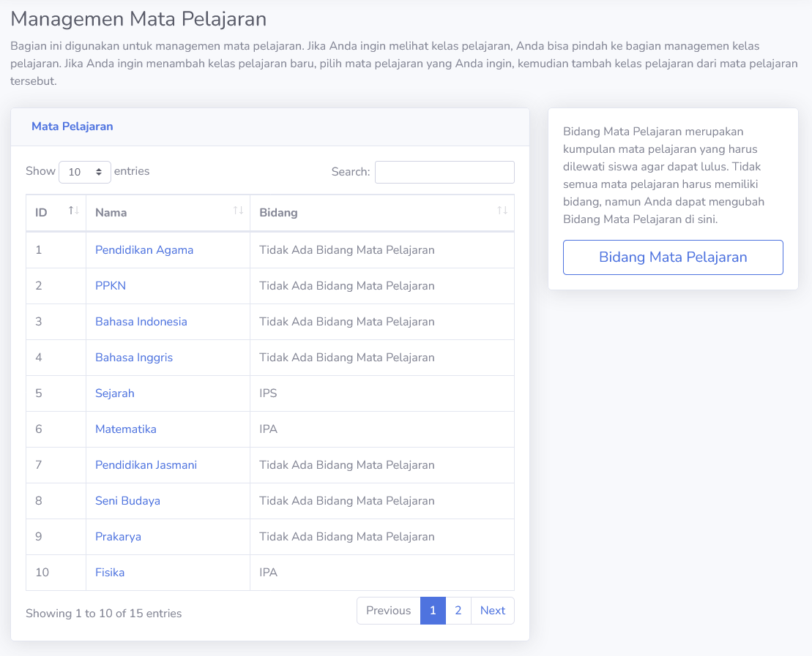
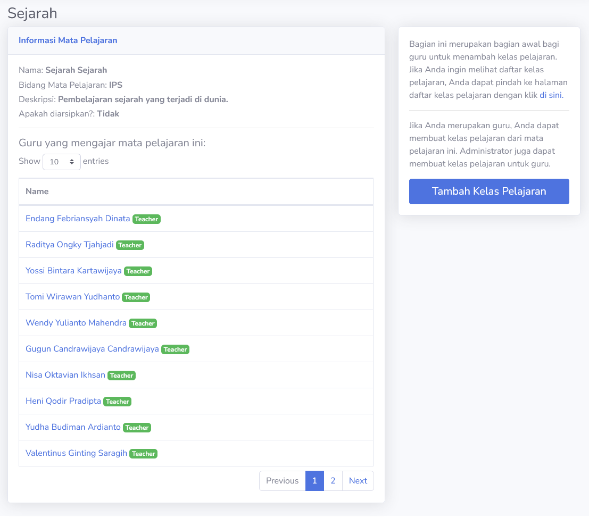
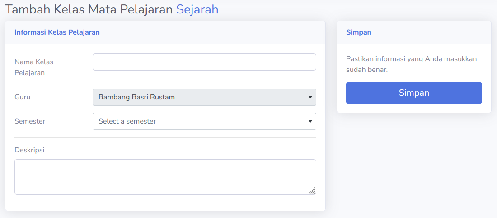
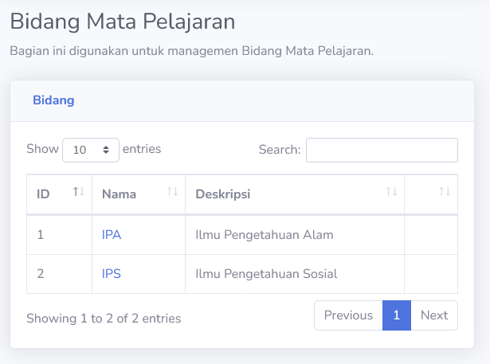

# Mata Pelajaran
Bagian ini menampilkan mata pelajaran yang disediakan oleh institusi pendidikan. Dimana kelas pelajaran adalah tempat siswa dan guru berinteraksi, mata pelajaran adalah tipe pelajaran yang kelas dapat mulai.

## Detil Mata Pelajaran
Guru dapat melihat informasi mata pelajaran yang ada dalam institusi pendidikan. Dalam bagian ini, mereka dapat melihat nama, bidang, deskripsi dan status arsip mata pelajaran. Pengguna juga dapat melihat informasi guru yang memiliki kelas pelajaran yang mengajar mata pelajaran ini.

Status arsip mata pelajaran berkait dengan ketersediaan mata pelajaran. Jika mata pelajaran diarsip, maka guru tidak dapat membuat mata pelajaran tersebut.

### Tambah Kelas Pelajaran
Disini, guru dapat membuat kelas pelajaran mereka. Tampilan ini mirip dengan tampilan edit kelas pelajaran. Guru dapat membuat kelas untuk mereka sendiri.

> [!WARNING]
> Untuk mengurangi miskomunikasi antar administrasi dan guru, pengguna direkomendasikan untuk tidak menambah kelas pelajaran setelah administrasi memasukkan siswa ke dalam kelas pelajaran. **Mohon koordinasi dengan administrasi akademik terlebih dahulu!**

## Bidang Mata Pelajaran
Bidang mata pelajaran adalah kategori mata pelajaran. Guru dapat melihat bidang yang ada. Secara umum, bidang hanya bisa dibuat oleh **Admin** untuk mata pelajaran.

