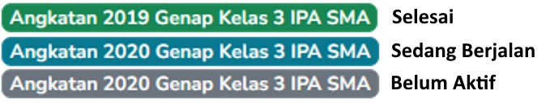
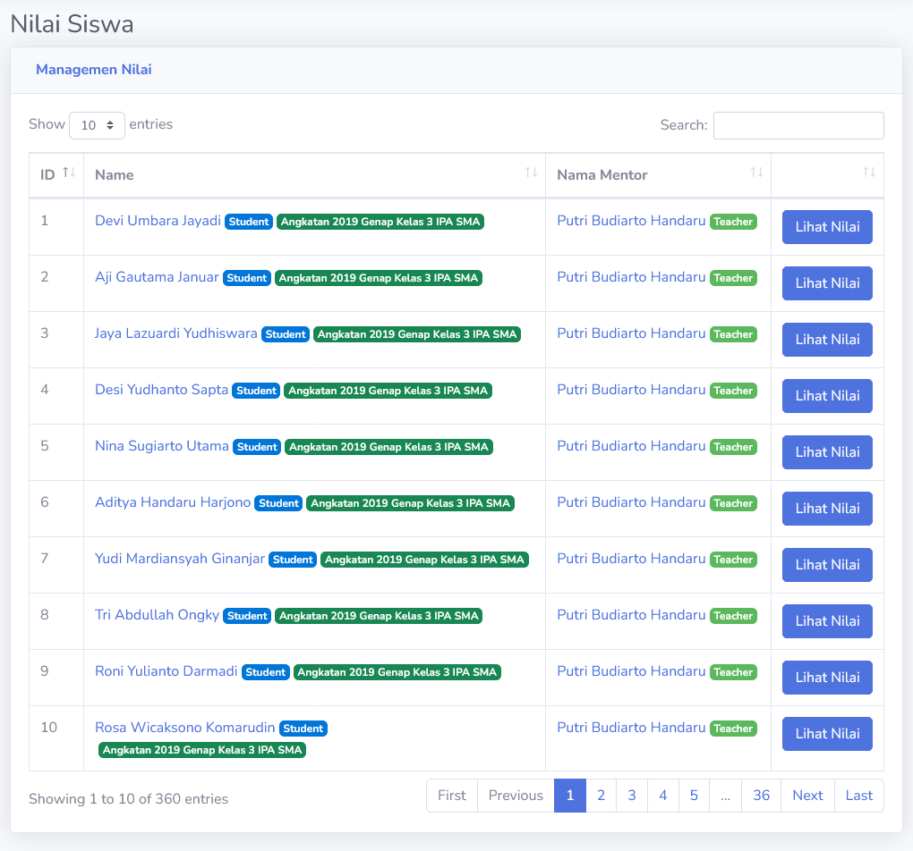

# Nilai
Jika dilihat dari halaman, nilai yang ditampilkan adalah daftar nilai siswa keseluruhan. Setiap guru dapat melihat nilai siswa keseluruhan dalam sistem.

> [!TIP]
> Warna tag semester disamping nama pelajar juga berfungsi sebagai indikator status semester. Semester akan berwarna **Cyan** jika sedang berjalan, **Hijau Tua** jika sudah selesai, dan **Abu-Abu** jika tidak aktif.
> 

## Nilai Siswa Keseluruhan
Guru dapat melihat nilai keseluruhan seorang siswa. Bagian ini juga dapat dilihat oleh orang tua siswa, dan siswa itu sendiri.

