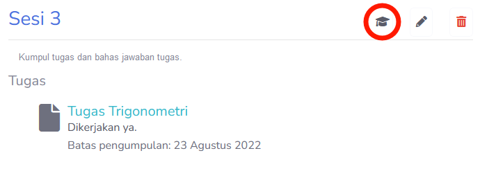

# Nilai Kelas Pelajaran
Dalam kelas pelajaran, nilai terpisah menjadi empat bagian; **Pengetahuan**, **Keterampilan**, **Sikap** dan **Personal Judgement**. Struktur nilai ini juga ada dalam sesi pelajaran, dimana guru harus isi sebelum mengisi nilai kelas pelajaran.

> [!TIP]
> Guru bisa mengisi nilai kelas pelajaran ketika ada nilai sesi yang kosong, tapi guru akan diberitahu untuk mengisi nilai yang kosong tersebut.

> [!INFO]
> Guru hanya dapat menilai siswa dalam kelas pelajaran ketika semester sudah selesai. Jika semester selesai, maka tombol **Performa Nilai** akan terbuka ketika mengakses kelas pelajaran. **Siswa tidak dapat mengakses kelas pelajaran setelah semester selesai.**
> 

## Nilai Kelas
Nilai kelas memiliki tiga bagian; **Nilai**, **Ringkasan** dan **Import Export**.

Bagian nilai adalah tempat guru untuk menilai siswa mereka. Jika siswa sudah dinilai, maka tanggal akan muncul, dan guru dapat melihat nilai siswa yang mereka berikan.

Ringkasan berisi informasi penilaian siswa. Guru dapat mengetahui apakah mereka sudah menilai semua siswa dalam kelas.

Bagian Import dan Export dapat dilihat [disini](../../general/import_export.md).

### Nilai Kelas Siswa
Guru dapat melihat nilai yang mereka berikan ke siswa disini. Jika ingin melakukan perubahan, guru dapat menekan tombol **Ubah Nilai**.

### Menilai Siswa
Penilaian dan mengubah penilaian siswa memiliki tampilan yang sama. Bagian **Pengetahuan** dan **Keterampilan** didapat secara otomatis dari nilai sesi kelas. Guru akan diberitahu jika ada sesi yang belum dinilai.

**Perilaku** atau **Penilaian Personal (Personal Judgement)** adalah nilai yang dapat diberikan. Catatan guru berisi informasi yang penilai dapat berikan.

Referensi nilai adalah nilai tugas yang dikumpul dan dinilai oleh siswa. Guru akan diberitahu jika siswa tidak mengumpulkan tugas yang diberikan, atau tugas tersebut belum dinilai.

## Nilai Sesi Kelas
Bagian sesi kelas dapat diakses kapan saja; sebelum, ketika atau selesai semester berjalan. Bagian ini dapat diakses melalui tombol **Nilai** pada bagian sesi.

Dalam halaman nilai sesi kelas, guru dapat melakukan penilaian siswa. Gambar berikut adalah gambar sesi yang sudah sepenuhnya dinilai. Ketika sudah dinilai, guru dapat melihat nilai langsung dari halaman ini.

Seperti bagian Nilai Kelas Pelajaran, halaman ini juga memiliki indikator penilaian. Bagian ini dapat membantu guru dalam penilaian siswa, untuk memastikan bahwa guru tidak lupa memberikan nilai.

### Menilai Sesi Siswa
Setelah menilai siswa, guru dapat melihat nilai siswa yang mereka telah nilai. Bagian **Nilai Pengumpulan Tugas** berguna untuk menampilkan nilai tugas dalam sesi. Jika guru ingin melakukan perubahan pada nilai sesi, bisa masuk ke halaman **Edit**.

Halaman **Edit** dan membuat nilai baru memiliki tampilan yang sama. Disini, guru dapat mengubah nilai, atau menilai siswa yang belum dinilai.

## Nilai Tugas
Pada bagian ini, guru dapat melihat tugas siswa yang sudah dikumpulkan. Pengguna dapat mengakses nilai dari halaman sesi kelas.

Pada bagian ini, guru dapat menilai atau menghapus nilai yang sudah diberikan. Tergantung dengan indikator status; **submitted** berarti siswa ada memasukkan tugas, dan **graded** berarti guru sudah menilai siswa. Untuk memberikan atau mengubah nilai, pengguna dapat mengakses halaman melalui **Nilai**.

> [!WARNING]
> Siswa dapat mengumpulkan tugas tanpa file. Jika indikator mengatakan bahwa file tidak ada, berarti siswa tidak mengupload apapun.

### Menilai Tugas
Guru dapat memberikan nilai pada tugas dari halaman berikut. Halaman ini berisi informasi dan data yang diberikan oleh siswa sebagai proses pengumpulan tugas.

Guru dapat memberikan komentar tugas dengan mengisi **Komentar Guru**. Hal ini opsional.

Bagian **Nilai Tugas** adalah nilai guru dari tugas yang telah diberikan.

Ketika sudah diberi nilai, perubahan dapat disimpan dengan tombol **Simpan Nilai**.

## Nilai Semester
Pengguna dapat melihat informasi tentang nilai semester [disini](../admin/nilai_semester.md).