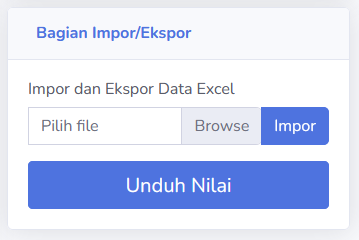

# Import dan Export Excel
Terkadang guru ingin memberikan nilai secara offline. Dengan fitur import dan export, guru dapat menilai menggunakan Excel. Setiap bagian penilaian yang ada memiliki fitur import dan export; nilai tugas, sesi, kelas dan semester.

Semua bagian penilaian memiliki struktur yang sama, dan mereka biasa ditempatkan di bagian penilaian. Guru pertama harus mendownload file excel yang disediakan. File ini berisi data siswa yang dapat dinilai.

Mereka dapat memberikan nilai ke siswa pada file ini. Setelah nilai diberikan, pengguna dapat meng-impor file ke dalam sistem pada tempat yang sama. Setelah file dipilih, pengguna hanya perlu menekan tombol **Impor**, dan sistem akan menilai siswa berdasarkan dari file tersebut.

